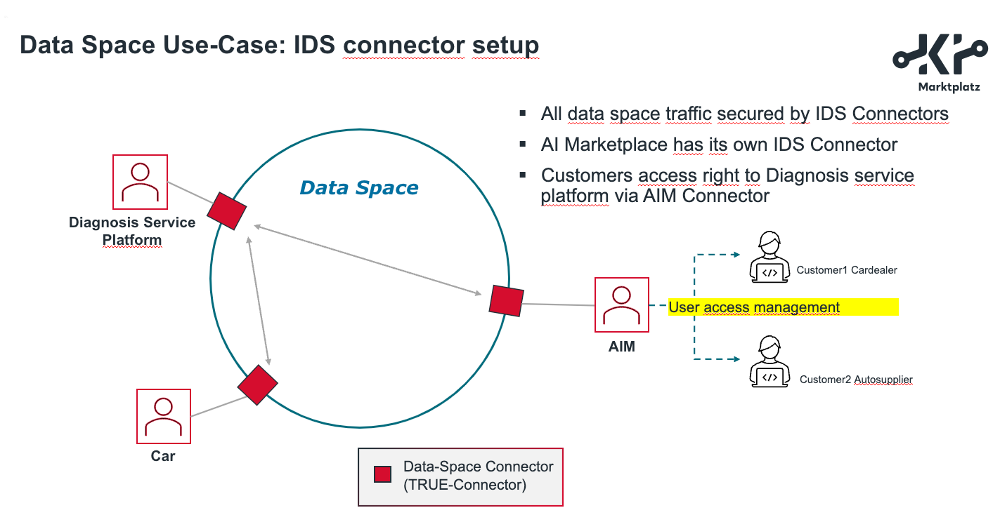

# KI-Marktplatz data space demonstrator

App-of-apps for the marketplace

This fork extends the standard installation of the KI-Marktplatz data marketplace 
by components for the data sharing Proof-of-Concepts (PoCs).

> :bulb: This repository just provides a setup for temporary demonstration purposes. It is not recommended to be used in a production enviroment. Credentials are visible in clear text and are not encrypted. Installations should be deleted when demonstrations/presentations/etc. have finished. 

The GitHub actions of this repo are configured to deploy a full instance with all components 
required for this PoC, as soon as a branch is created. It is meant for a temporary deployment only. 
Note that the deployment should be deleted after 
each presentation/demo/etc., since there are only test accounts registered and credentials are visible in clear text in this 
repo.

Before moving this installation to a production environment, make sure to encrypt all credentials, keys, etc., e.g., 
using [sealed-secrets](https://github.com/bitnami-labs/sealed-secrets).

All scripts are developed for using an OpenShift Kubernetes cluster, but can be easily adapted for any 
kind of infrastructure.


## Deployment

It is required to setup two GitHub secrets in the 
repository ([also check this manual](https://github.com/FIWARE-Ops/marinera/blob/main/documentation/GITHUB_CI.md#openshift-service-account-permissions)):
* `OPENSHIFT_SERVER`: Server URL of the OpenShift cluster
* `OPENSHIFT_TOKEN`: Token from an OpenShift service account with sufficient permissions for creation/deletion of projects and applications, role assignments and deployments via Helm charts (e.g., with `cluster-admin` role) 

In order to deploy all components, simply create a branch which is named `poc-*` (poc-02 in the following text). 
The GitHub action will deploy all components to the namespace `kim-poc-02`. 

Routes for externally exposed services are automatically created and hostnames are set dynamically. In order to 
retrieve the created hostnames, one can run, e.g., 
```shell
kubectl -n kim-poc-02 get routes
```
or check in the OpenShift console or in ArgoCD.

For the marketplace, the branch was called `poc-02`, this gives you 
```shell
NAME                                      HOST/PORT                                                       PATH   SERVICES                                PORT         TERMINATION     WILDCARD
marketplace-biz-ecosystem-logic-proxy-0   bae-lp.kim-poc-02.fiware.dev                                           marketplace-biz-ecosystem-logic-proxy   <all>        edge/Redirect   None
```
The marketplace would be available under the URL: `https://bae-lp.kim-poc-02.fiware.dev/`.


### Uninstall

For removing all components and deleting the applications and namespace, simply remove the branch `poc-02`.


## Credentials

Different accounts are created automatically with default passwords.

| Component     | Username               | Password          | Comment |
|---------------|------------------------|-------------------|---------|
| Keyrock Marketplace | admin@test.com | admin | Admin user of the marketplace |
| Keyrock Hella Provider | admin@test.com | admin | Admin user of the Provider Keyrock IDP |
| Keyrock Hella Provider | operator@provider.com | operator | Operator employee user of the Provider |
| Keyrock Automotive Supplier | admin@test.com | admin | Admin user of the Automotive Supplier Keyrock IDP |
| Keyrock Automotive Supplier | operator@autosupplier.com | operator | Operator employee user of Automotive Supplier |
| Keyrock Automotive Supplier | user@autosupplier.com | user | Standard user of Automotive Supplier |
| Keyrock Car Dealer | admin@test.com | admin | Admin user of the Car Dealer Keyrock IDP |
| Keyrock Car Dealer | operator@cardealer.com | operator | Operator employee user of Car Dealer |
| Keyrock Car Dealer | user@cardealer.com | user | Standard user of Car Dealer |
| - | - | - | - |
| Keyrock Car Dealer Local| operator-local@cardealer.com | operator | Local Operator employee user of Car Dealer |

Root CA, keys and certificates have been created and self-signed using openssl. Keys and certificates used for this PoC 
can be found in the [certs folder](./certs). These should never be used in any kind of production enviroment or on a 
contineously running environment.  
Below table displays the assigned EORIs assigned to the different organisations and their keys/certificates:
| Organisation           | EORI                       |
|------------------------|----------------------------|
| Satellite              | EU.EORI.FIWARESATELLITE    |
| Marketplace            | EU.EORI.DEMARKETPLACE      |
| Hella                  | EU.EORI.DEHELLA            |
| Automotive Supplier    | EU.EORI.DEAUTOSUPPLIER     |
| Car Dealer             | EU.EORI.DECARDEALER        |


## Use case descriptions

Argo-CD will deploy quite a number of Helm-Charts applications to deliver 2 use cases in one setup via Helm Charts. Here a total overview of the contained applications. Not all applications are relevant for both use cases. Some generic background services, relevant for both use cases, are colored in light grey in the lower right corner. 


The following gives a description of the steps to be performed for the data space use cases in the demonstrator.


### i4Trust use case

The i4Trust use case demonstrates data sharing within an i4Trust data space. This involves iSHARE specifications 
for the Identity and Access Management (IAM) as well as FIWARE Context Broker technology using NGSI-LD for the actual 
data exchange. 

The KI-Marktplatz allows service providers to offer their data and services in a plug&play mechanism.  
Service consumers can discover such offerings and acquire access to them. During the acquisition, the KI-Marktplatz 
will automatically create the necessary access policies at the service provider's IAM infrastructure, so that the 
service consumer can directly start to access the service.

A very detailed description of all involved interactions and requests between the different components during creation 
of offering, acquisition of offerings and the actual service access, can be found in 
the [i4Trust Building Blocks documentation](https://github.com/i4Trust/building-blocks).


#### i4Trust endpoints

When using the i4Trust data space, the NGSI-LD endpoint is reacheable via the path `/diagnosis-i4trust/ngsi-ld/v1/entities`. 

Example call:
```shell
curl -X GET --header "Authorization <JWT>" https://hella-kong-kong-kim-poc-02.apps.fiware.fiware.dev/diagnosis-i4trust/ngsi-ld/v1/entities/<ENTITY-ID>
```
where `<JWT>` is a signed [iSHARE JWT](https://dev.ishare.eu/introduction/jwt.html) access token issued by an IDP or by the service provider.


#### Architecture

The following diagram gives an overview of the involved organisations and components in the i4Trust use case.


* Data Marketplace  
The data marketplace is part of the KI-Marktplatz platform and is based on 
the [FIWARE Business API Ecosystem](https://business-api-ecosystem.readthedocs.io/en/latest/). It consists of different 
components for providing the necessary APIS, databases, business logic and user interface. Different digital asset types 
are represented by different asset plugins. For a data service based on i4Trust, the 
[bae-i4trust-service](https://github.com/i4Trust/bae-i4trust-service) plugin is installed, which implements the 
necessary offering meta data to be entered by service providers and the interactions for creating policies 
described in the following.

* Cars  
Cars are continiously sending data to the diagnosis platform for further data processing. This part will be simulated in 
this demonstrator.

* Service Provider - Hella Diagnosis Platform  
The diagnosis platform aggregates the car data in order to offer the diagnosis data using a FIWARE 
[Context Broker](https://github.com/FIWARE/context.Orion-LD) instance 
via the NGSI-LD API.  
The data service is protected by a Policy Enforcement Point (PEP) completed with a Policy Decision 
Point (PDP) following 
the [iSHARE specifications](https://dev.ishare.eu/index.html) for the 
service access. Both functionalities, PEP and PDP, 
are implemented using the [Kong API Gateway](https://docs.konghq.com/gateway/2.8.x/) and 
the [ngsi-ishare-policies](https://github.com/FIWARE/kong-plugins-fiware/tree/main/kong-plugin-ngsi-ishare-policies) Kong 
plugin.  
When evaluating the requested service access, the PDP will connect to an Authorization Registry following 
the [iSHARE specifications](https://dev.ishare.eu/delegation/endpoint.html) and look up required access policies 
issued to the requesting organisation (here, the authorization registry functionality is implemented within 
the [Keyrock](https://fiware-idm.readthedocs.io/en/latest/) Identity Provider). The Authorization 
Registry is completed with an [Activation Service](https://github.com/i4Trust/activation-service), which allows the 
marketplace to create policies on behalf of the 
service provider.  
Users are registered within the Identity Provider (IDP) based on [Keyrock](https://fiware-idm.readthedocs.io/en/latest/). 
This allows users, e.g., an operator or 
administrative user of the service provider, to login at the marketplace and create offering on behalf of the 
service provider.

* Service Consumers - Automotive Supplier and Car Dealer  
The service consumer organisations, the automotive supplier and the car dealer, both operate own instances of 
IDPs, where their users are registered. This allows administrative users to login at the marketplace and acquire 
access to the service provider's offering on behalf of the service consumer organisation. After service acquisition, 
users can use scripts or applications for accessing the data service of the service provider.

* Trust Authority - iSHARE Satellite  
A trust authority is necessary within the data space in order to ensure trust among all data space 
participants/organisations and it is based on the iSHARE Satellite. The satellite is involved in all interactions 
between data space participants. When receiving requests, it allows organisations to verify the signature of the 
requesting participants using 
the [/trusted_list](https://dev.ishare.eu/scheme-owner/trusted-list.html) endpoint and to ensure that these are trusted 
and active participants of the data space using the [/parties](https://dev.ishare.eu/scheme-owner/parties.html) endpoint.


#### Helm-Charts applications involved in the i4Trust use case

The following diagram gives an overview of the applications involved in the i4Trust use case.


#### Create service offering

In order to publish the data service, the service provider first needs to create an offering on the marketplace. 
The following diagram gives an overview of this process.


1. An operator or administrative user visits the data marketplace and is offered different external IDPs that have 
   been registered at the marketplace. It selects the IDP of the service provider and is forwarded to its login page 
   for entering the credentials. 
2. The IDP will verify against the satellite, whether the marketplace is a trusted 
   participant of the data space. 
3. When the login succeeded, the user is sent back to the landing page of the marketplace. The user now can create an 
   offering for the diagnosis service using the i4Trust based asset type, by providing all necessary information like 
   the actual endpoint of the service, 
   the endpoint of the authorization registry (more precisely, the endpoint of the activation service) or the access 
   rights that organisations will obtain when acquiring this offering.
   
Per default, the offering is automatically created during deployment of this demonstrator. This can be switched off 
by setting the i4trust.enabled Parameter in Line 660 to `false` in the marketplace [values.yaml](./applications/marketplace/values.yaml) 
file.


#### Acquisition of service offering

After the offering has been created on the marketplace, it can be discovered and acquired by other organisations. 
In the following it will be assumed that the automotive supplier will be the consumer organisation, but the process 
is identical for any other organisations acquiring access to the service offering. 
The following diagram gives an overview of this process.


1. An operator or administrative user of the service consumer visits the data marketplace and is offered different 
   external IDPs that have been registered at the marketplace. It selects the IDP of the service consumer (here: 
   automotive supplier) and is forwarded to its login page for entering the credentials. 
2. The IDP will verify against the satellite, whether the marketplace is a trusted 
   participant of the data space. 
3. The user can browse through the available offerings and selects the i4Trust-based diagnosis service for purchase. 
   After performing the checkout, the marketplace (more precisely, the i4Trust asset plugin in the charging backend 
   component) will send a request to the activation service of the service provider for creating a policy issued to 
   the service consumer (here: the automotive supplier) stating the necessary attribute-based access rights for 
   accessing the NGSI-LD based diagnosis service of the service provider. 
4. Before inserting the policy into the authorization registry, the activation service will verify that the marketplace 
   is allowed to create policies on behalf of the service provider. This is done by checking for a policy issued to 
   the marketplace that was created during [deployment](./applications/hella-keyrock/templates/create-policy-cm.yaml). 
   Furthermore, it is verified against the satellite, that the marketplace is a trusted participant of the data space 
   and provided a valid signature.
   
   
#### Service access

After acquisition of the service offering, the organisation can access the diagnosis service of the service provider. 
In the following it will be assumed that the automotive supplier will be the consumer organisation, but the process 
is identical for any other organisations accessing the service. A user of the consumer organisation will use a script 
or an application for performing the necessary steps of 
an [iSHARE-based M2M interaction](https://dev.ishare.eu/m2m/authentication.html), described in the following diagram.

  

1. An [iSHARE JWT](https://dev.ishare.eu/introduction/jwt.html) is created and signed by the consumer 
   organisation. Using this JWT, a request is send to the service provider for retrieving an access token (here, the 
   Keyrock IDP provides the necessary `/token` endpoint).
2. The IDP of the service provider verifies the signature of the JWT and checks at the satellite whether the service 
   consumer is a trusted participant of the data space. A signed JWT access token is returned to the consumer 
   organisation.
3. Using the access token, the service consumer sends an NGSI-LD request to the PEP endpoint of the service provider 
   for retrieving the diagnosis data.
4. The PDP will verify the signature of the access token using the satellite.
5. The PDP retrieves the access policies at the authorization registry issued to the consumer organisation and checks, 
   whether these policies allow the requested NGSI-LD operation.
6. If access is granted, the PEP will forward the NGSI-LD request to the context broker of the service provider. 
   The Context Broker response with the diagnosis data is returned to the consumer organisation.
   
There is an example script [get_data_m2m_i4trust.py](./scripts/get_data_m2m_i4trust.py) which automatizes the process of obtaining an access token 
and retrieving diagnosis data at the PEP/PDP Kong instance of the service provider. This should be run on behalf of the service consumer 
organisation after acquisition of the access rights. It will only work with the FIWARE Kubernetes cluster, but shows how 
to perform the necessary operations in a script or application.  
Usage:
```shell
python scripts/get_data_m2m_i4trust.py <NAMESPACE> <PARTY> <OPERATION>
```
where `<NAMESPACE>` denotes the mandatory parameter of the deployed namespace (e.g., `kim-poc-*`), 
`<PARTY>` is the optional parameter of the consuming party (default: `autosupplier`, other options: `cardealer`) and 
`<OPERATION>` is the optional parameter of the type of the operation (default: `GET`, other options: `POST`).


### IDS use case

The IDS use case demonstrates data sharing within an IDS data space. This involves IDS RAM specifications for the Identity and Access Management (IAM) as well as FIWARE Context Broker technology using NGSI-LD for the actual data exchange. 

The KI-Marktplatz allows service providers to offer their data and services in a plug&play mechanism.  
Service consumers can discover such offerings and acquire access to them. During the acquisition, the KI-Marktplatz 
will automatically create the necessary access policies at the local KI-Marktplatz Keyrock IDP, so that the 
service consumer can directly start to access the service via the local IDS Connector.


#### IDS endpoints

When using the IDS data space, the NGSI-LD endpoint is reacheable via the path `/kim/ids-input/ngsi-ld/v1/entities`. 

Example call:
```shell
curl -X GET --header "Authorization: Bearer <Access Token>" --header "Forward-To: <Public Provider IDS Connector URL> "https://hella-kong-kong-kim-poc-02.apps.fiware.fiware.dev/kim/ids-input/ngsi-ld/v1/entities/<ENTITY-ID>
```
where `<Access Token>` is a bearer access token issued by the Marketplace Keyrock IDP after a local Marketplace User (here operator-local@cardealer.com) having gained access rights with buying an IDS data product protected by the Marketplace owned IDS Connector

where `<Public Provider IDS Connector URL>` is the publicly available Data Provider IDS Connector URL


#### IDS use case overview

The following diagram gives an overview of the IDS use case.



* AIM (KI-Marktplatz)
The AIM is part of the KI-Marktplatz platform and is based on 
the [FIWARE Business API Ecosystem](https://business-api-ecosystem.readthedocs.io/en/latest/). It consists of different 
components for providing the necessary APIS, databases, business logic and user interface. Different digital asset types 
are represented by different asset plugins. For a data service based on IDS, the 
bae-kim-service plugin (plugins folder of this repo) is installed, which implements the 
necessary offering meta data to be entered by service providers and the interactions for creating policies 
described in the following.

* Car  
Cars are continiously sending data to the Diagnosis Service Platform for further data processing via an own IDS Connector and via the IDS data space. This part will be simulated by the kim-cardatagenerator application in this demonstrator.

* Diagnosis Service Platform
The diagnosis service platform aggregates and enriches the data received from the cars (via IDS data space) 
in order to offer the diagnosis data using a FIWARE [Context Broker](https://github.com/FIWARE/context.Orion-LD) instance via the NGSI-LD API.  
The data service is protected by an IDS TRUE Connector (No IDS policies and contract negotiations in this PoC, fine-grained access management on user and access path level will be performed by the KI-Marktplatz Kong-PEP-Proxy evaluating policies stored in the KI-Marktplatz local Keyrock IDP). 

* Service Consumers - Cardealer and Autosupplier  
The service consumer organisations, the automotive supplier and the car dealer, have to have registered users at the KI-Marktplace local Keyrock IDP. 
This allows administrative users to login at the marketplace and acquire access to the service provider's offering. 
After service acquisition, users can use scripts or applications for accessing the data service of the service provider.


#### Helm-Charts applications involved in the i4Trust use case

The following diagram gives an overview of the applications involved in the i4Trust use case.


#### Car data generation (red "1" marks in the application overview above)

In order to publish the data service, the service provider first needs to create an offering on the marketplace. 
This process is described in the [general marketplace documentation](https://business-api-ecosystem.readthedocs.io/en/latest/user-guide.html).
Main aspects to be defined here is the NGSI-LD access path to be offered access permissions for and the price details of the offering. 
   
Per default, the offering is automatically created during deployment of this demonstrator. This can be switched off 
by setting the ids.enabled Parameter in Line 674 to `false` in the marketplace [values.yaml](./applications/marketplace/values.yaml) 
file.


#### Create service offering

In order to publish the data service, the service provider first needs to create an offering on the marketplace. 
This process is described in the [general marketplace documentation](https://business-api-ecosystem.readthedocs.io/en/latest/user-guide.html).
Main aspects to be defined here is the NGSI-LD access path to be offered access permissions for and the price details of the offering. 
   
Per default, the offering is automatically created during deployment of this demonstrator. This can be switched off 
by setting the ids.enabled Parameter in Line 674 to `false` in the marketplace [values.yaml](./applications/marketplace/values.yaml) 
file.


#### Acquisition of service offering (purple "a" mark in the application overview above)

After the offering has been created on the marketplace, it can be discovered and acquired by other users and organisations. 
In the following it will be assumed that the Cardealer Operator will be the consuming user, but the process 
is identical for any other organisations acquiring access to the service offering. 

1. The Cardealer Operator user logs in at the KI-Marktplatz local Keyrock IDP. 
2. The user can browses through the available offerings and selects the IDS-based diagnosis service for purchase. 
   After performing the checkout, the marketplace (more precisely, the bae-kim-service asset plugin in the charging backend 
   component) will send a request to the local Keyrock IDP for creating an access policy for the defined NGSI-LD access path, creating an access role and assigning this access role to the purchasing user.
   
   
#### Service access (green "2" and purple "b" marks in the application overview above)

After acquisition of the service offering, the organisation can access the diagnosis service of the service provider. 
In the following it will be assumed that the Cardealer Operator will be the consuming user, but the process 
is identical for any other organisations acquiring access to the service offering. A user of the consumer organisation will use a script 
or an application for performing the necessary steps.

1. The Cardealer Operator will obtain an access token from the KI-Marktplatz Keyrock IDP.
2. Using the access token and the Public Provider IDS Connector URL, the Cardealer Operator sends an NGSI-LD request to the PEP endpoint of the KI-Marktplatz.
3. The PDP will verify the access rights to the requested NGSI-LD access path for the Cardealer Operator.
4. After receing a permit evaluation, the NGSI-LD request will be forwarded to the KI-Marktplatz own IDS Connector.
5. The NGSI-LD request will be send to the provider IDS Connector. 
   The Context Broker response with the diagnosis data is returned to the Cardealer Operator.
   
There is an example script [get_data_m2m_i4trust.py](./scripts/get_data_m2m_i4trust.py) which automatizes the process of obtaining an access token 
and retrieving diagnosis data at the PEP/PDP Kong instance of the service provider. This should be run on behalf of the service consumer 
organisation after acquisition of the access rights. It will only work with the FIWARE Kubernetes cluster, but shows how 
to perform the necessary operations in a script or application.  
Usage:
```shell
python scripts/get_data_m2m_i4trust.py <NAMESPACE> <PARTY> <OPERATION>
```
where `<NAMESPACE>` denotes the mandatory parameter of the deployed namespace (e.g., `kim-poc-*`), 
`<PARTY>` is the optional parameter of the consuming party (default: `autosupplier`, other options: `cardealer`) and 
`<OPERATION>` is the optional parameter of the type of the operation (default: `GET`, other options: `POST`).

